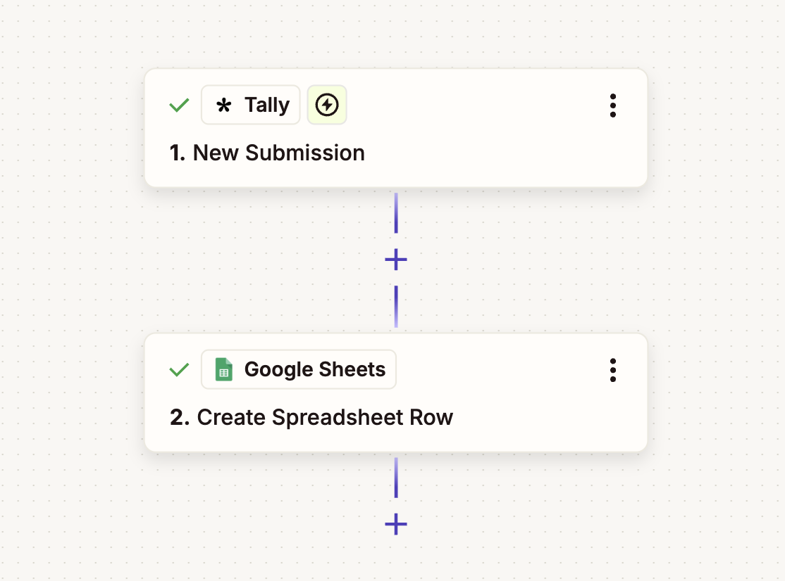

# lead-intake-tracker
A lightweight intake pipeline for a small hypothetical SAT/ACT tutoring business that automatically captures form submissions and logs them as structured rows in a Google Sheet — no manual data entry required.

📸 **Zapier Workflow**: 
🎥 **Demo Video:** [Watch the demo](https://drive.google.com/file/d/1w_W0O92Ww-QrZdW1aIkLhStgXeVRhftb/view?usp=sharing)

---

## ✨ What It Does

1. **Intake Form** — families submit their info via a Tally form embedded on the business website: parent name, student name, contact info, target test, target score, and referral source
2. **Automated Logging** — Zapier detects each new Tally submission and instantly writes a structured row to a Google Sheet — no inbox monitoring, no copy-pasting
3. **Pipeline Tracker** — every inquiry lands in a shared Google Sheet with a Stage dropdown (New Inquiry → Consultation Booked → Consultation Completed → Enrolled) so the business owner always knows where each family stands
4. **Zero Manual Entry** — from form submission to tracked lead happens automatically in seconds

---

## 🧠 Why I Built This

Most small service businesses — tutoring companies, consultants, coaches — have a contact form on their Wix or Squarespace site. When someone submits it, the inquiry lands in an email inbox with no structure, no tracking, and no follow-up system. Leads fall through the cracks without anyone knowing.

I built this to replace that with a simple, automated pipeline that costs nothing to run and requires no technical knowledge to maintain.

---

## ⚙️ Architecture

Tally Form → Zapier (New Submission trigger) → Google Sheets (Create Row action)

---

## 🛠 Tools Used

- **Tally** — free form builder, cleaner and more flexible than native Wix/Squarespace forms
- **Zapier** — no-code automation that connects Tally to Google Sheets on every submission
- **Google Sheets** — serves as the live pipeline tracker with dropdown stage management

---

Built with Tally, Zapier, and Google Sheets. No code required.
